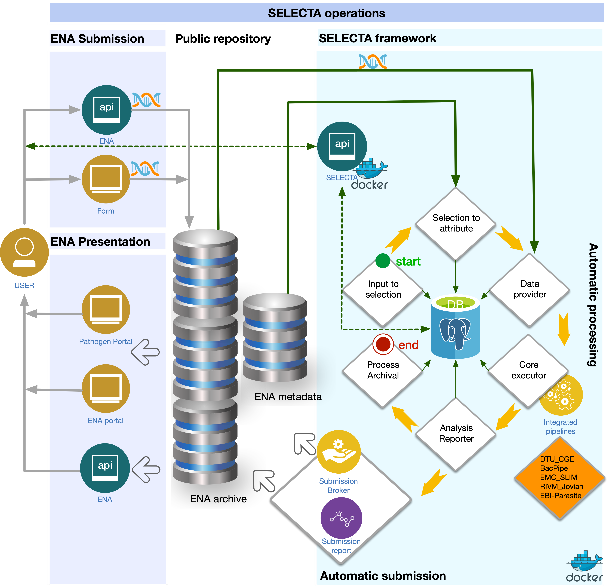
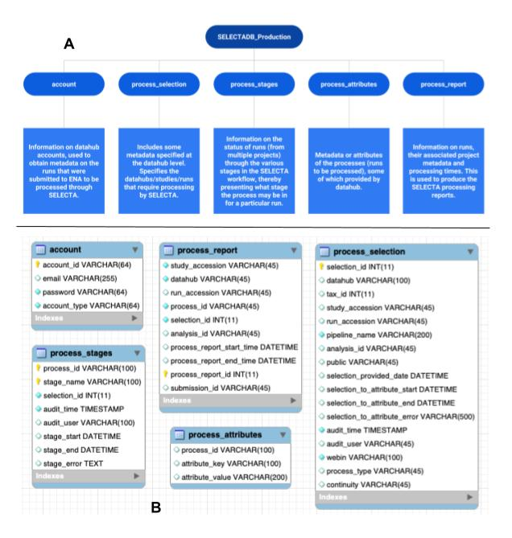

# ebi-selecta


#### Please follow these links for documentation specifically for developers
  - [Detail pdf documentation](https://github.com/EBI-COMMUNITY/ebi-selecta/blob/master/SELECTA_Developer_Documentation.pdf)
  - [Source code documentation](https://ebi-community.github.io/ebi-selecta/)

#### Contents:
1. [What is SELECTA?](#What-is-selecta?)
2. [SELECTA framework Docker-Compose version](#SELECTA-framework-Docker-Compose-version)
3. [Installation](#installation)
    - [On Ubuntu](#On-Ubuntu)
    - [On Windows and Mac](#On-Windows-and-Mac)
4. [Retrieving the SELECTA docker-compose version](#Retrieving-the-SELECTA-docker-compose-version)
5. [Usage on a single computer](#Usage-on-a-single-machine)
    - [Launch SELECTA](#Launch-SELECTA)
6. [SELECTA API](#SELECTA-API)
7. [Minimum requirement for a SELECTA processing](#Minimum-requirement-for-a-SELECTA-processing)
    - [Create a SELECTA user account](#Create-a-SELECTA-user-account)
    - [Create a SELECTA rule](#Create-a-SELECTA-rule)
8. [Retrieve SELECTA database data](#Retrieve-SELECTA-database-data) 
    - [Via SELECTA API](#Via-API)
    - [Via Postgres PgAdmin client](#Via-Postgres-PgAdmin-client)
9. [Run SELECTA Workflow manually](#Run-SELECTA-Workflow-manually)
    - [Selection_to_attribute Stage](#Selection_to_attribute-Stage)
    - [Data_provider Stage](#Data_provider-Stage)
    - [Core_executor Stage](#Core_executor-Stage)
    - [Analysis_reporter Stage](#Analysis_reporter-Stage)
    - [Process_archival Stage](#Process_archival-Stage)
10. [Run SELECTA Workflow automatically](#Run-SELECTA-Workflow-automatically)               
11. [Usage on a SWARM cluster](#Usage-on-a-SWARM-cluster)
    - [Initialize SELECTA swarm cluster](#Initialize-SELECTA-swarm-cluster)
    - [launch SELECTA in the swarm cluster](#launch-SELECTA-in-the-swarm-cluster)
    - [remove the swarm cluster](#remove-the-swarm-cluster)
12. [Background](#background)
    - [Workflow](#workflow)
    - [Database](#database)


### What is SELECTA?

SELECTA is a rule-based workflow engine that runs analytical pipelines, first developed to manage pipelines specifically for the COMPARE community. However, SELECTA can also be setup to manage other user provided analytical pipelines.
SELECTA automatically submits the analysis results output by the analytical pipelines back to the European Nucleotide Archive (ENA) mitigating the burden for a submitter when handling bulk submissions and ensures a consistent and accurate record of the analysis results.

### SELECTA framework Docker-Compose version.

This repository provides SELECTA toolkits as a set of Dockerfiles, configuration docker-compose files to launch the SELECTA 
framework without the requirement of installing every SELECTA component individually. This repository also provides a script (init_swarm.sh) to initialize a docker swarm environment and a stack file to launch the framework in a docker swarm cluster.
 There is also a script to remove entirely (rm_swarm.sh) the created swarm cluster environment.


### Installation

The open-source software Docker and Docker-compose must be pre-installed for the proper functioning of the SELECTA docker-compose version:  

#### On Ubuntu:

Add the GPG key for the official Docker repository to the operating system.

```
curl -fsSL https://download.docker.com/linux/ubuntu/gpg | sudo apt-key add -
```

Add the Docker repository to the APT (Advanced Package Tool) sources.

```
sudo add-apt-repository "deb [arch=amd64] https://download.docker.com/linux/ubuntu $(lsb_release -cs) stable"
```

Next, update the Ubuntu package database with the newly added docker packages repository.

```
sudo apt-get update
```

Install the Docker community edition:

```
sudo apt-get install -y docker-ce
```

Verify that Docker daemon is running with the following command:

```
sudo systemctl status docker
```

Next, install the docker-compose and make it executable.

```
sudo curl -L https://github.com/docker/compose/releases/download/1.18.0/docker-compose-`uname -s`-`uname -m` -o /usr/local/bin/docker-compose && sudo chmod +x /usr/local/bin/docker-compose
```

Finally, verify that docker-compose installation is successful by checking its version.
```
docker-compose --version
```

#### On Windows and Mac:
Install the executable from the docker-compose page:

```
https://docs.docker.com/compose/install/
```

### Retrieving the SELECTA docker-compose version
Retrieve the docker-compose version from the Github to launch the docker-compose version of the SELECTA framework.

Clone this repository:
```
git clone <repo>
```

If utilising for COMPARE you will also want to obtain the following codebases for the integrated COMPARE pipelines:
 - [DTU_CGE](https://bitbucket.org/genomicepidemiology/cge-tools-docker/src/master/)
 - [EMC_SLIM](https://github.com/EBI-COMMUNITY/slim_emc)
 - [UAntwerp_Bacpipe](https://github.com/wholeGenomeSequencingAnalysisPipeline/BacPipe)
 - [RIVM_Jovian](https://github.com/DennisSchmitz/Jovian) (private, request by email)

Alternatively, obtain the codebases of the analysis pipelines that you wish to implement in SELECTA.


### Usage on a single computer

To launch the SELECTA framework on a single machine.
Access the SELECTA docker repository:

```
cd </path/to/ebi-selecta>
```

##### Launch SELECTA

```
Docker-compose up --build -d
```
The last command in detach mode will pull the SELECTA required images dependencies from Docker hub and build where necessary 
SELECTA-tools docker images and finally launch all the SELECTA containers. The docker-compose also creates a docker network
that allows communication between the SELECTA docker containers.

## SELECTA API
We provide in this repository SELECTA API [documentation](service_api/README.md) detailing SELECTA endpoints. SELECTA API implements both the GET and POST methods.

## Minimum requirement for a SELECTA processing:

The SELECTA framework is database-centric. Two main tables, the Account and the Process_Selection tables, contain mandatory requirements to enact SELECTA processing. SELECTA API facilitates populating these tables with the required attributes. 
The API listens to port 5002 on the localhost, and the accompanying docker-compose.yml file defines this port.

- #### Create a SELECTA user account

The following command will create an account for dcc_xxxx 

```json
curl -d '{"account_id":"dcc_test","account_type":"datahub","email": "selecta@ebi.ac.uk","password": "letmein"}' -H "Content-Type: application/json" -X POST http://localhost:5002/account
```
- #### Create SELECTA rule

The PROCESS_SELECTION table sports the processing rules for each datahub. Here we define the analytical workflow name that
is responsible for analyzing the data from a specific datahub or study or run. 
The following command creates a rule in the PROCESS_SELECTION table for processing data from datahub dcc_dvorak with analysis workflow UAntwerp_Bacpipe; the rule ensures that the analysis of the run is an ongoing process by setting the CONTINUITY flag to YES.  
This specific rule continually analyzes a specific run data in the dcc_dvorak datahub.


```json
curl -d '{"datahub": "dcc_dvorak","run_accession": "ERR1102130","pipeline_name": "UAntwerp_Bacpipe","public": "NO","webin": "Webin-45433","continuity": "YES","process_type": "run"}' -H "Content-Type: application/json" -X POST http://localhost:5002/input2selection
```

### Retrieve SELECTA database data

#### Via API

##### Fetch all SELECTA account 

```
curl  -H "Content-Type: application/json" -X GET http://localhost:5002/accounts

```
##### Fetch all SELECTA rules

```
curl  -H "Content-Type: application/json" -X GET http://localhost:5002/selections

```

#### Via Postgres PgAdmin client
```
Http:localhost:5050 with the following: username: selecta@ebi.ac.uk/letmein

```

### Run SELECTA Workflow manually
When manually running each SELECTA stage, run each of the following scripts sequentially:
selection_to_attribute.py, data_provider.py, core_executor.py, analysis_reporter.py, and process_archival.py. Each script require SELECTA configuration file (properties.txt) as an argument:

#### Selection_to_attribute Stage
```
docker run -ti --rm --network=ebi-selecta_postgres embl-ebi/selecta_selection_to_attribute:1.0 /usr/scr/app/scripts/selection_to_attribute.py -p /usr/scr/app/resources/properties.txt
```

#### Data_provider Stage
```
docker run -ti --rm --network=ebi-selecta_postgres embl-ebi/selecta_data_provider:1.0 /usr/scr/app/scripts/data_provider.py -p /usr/scr/app/resources/properties.txt
```

#### Core_executor Stage
```
docker run -ti --rm --network=ebi-selecta_postgres embl-ebi/selecta_core_executor:1.0 /usr/scr/app/scripts/core_executor.py -p /usr/scr/app/resources/properties.txt
```

#### Analysis_reporter Stage
```
docker run -ti --rm --network=ebi-selecta_postgres  embl-ebi/selecta_analysis_reporter:1.0 /usr/scr/app/submission/analysis_reporter.py -p /usr/scr/app/resources/properties.txt
```

#### Process_archival Stage
```
docker run -ti --rm --network=ebi-selecta_postgres embl-ebi/selecta_process_archival:1.0 /usr/scr/app/scripts/process_archival.py -p /usr/scr/app/resources/properties.txt
```


### Run SELECTA Workflow automatically
To automate the steps described above, create individual cronjobs for each stage to run periodically. 

### Usage on a SWARM cluster

Access the SELECTA docker repository:
```
Cd </path/to/ebi-selecta>
```
### Initialize SELECTA swarm cluster
```
./init_swarm.sh
```

Confirm cluster creation
```
docker node ls
docker node inspect node-id
```
### launch SELECTA in the swarm cluster
To launch SELECTA in the swarm cluster, issue the following command:
```
Docker stack deploy -c docker-stack-compose.yml selecta
```

The last command will pull the SELECTA required images from the docker hub and launch all the SELECTA services as 
configured in the docker-stack-compose YAML file.

The SELECTA framework integrates a swarm visualizer that is accessible at
```
http://localhost:8080
``` 

To scale up core_executor service, issue the following command:
```
docker service scale selecta_core_executor=10
```
Confirm that the service has scaled up via swarm visualizer at http://localhost:8080

To scale down core_executor service, issue the following command:
```
docker service scale selecta_core_executor=1
```
Confirm that the service has scaled up via swarm visualizer at http://localhost:8080

### remove the swarm cluster
To remove the swarm cluster, issue the following command:
```
rm_swarm.sh
```
---
### Useful docker commands

The following are some useful docker commands to interacts with the containers in the SELECTA framework.

Show active containers:

```
Docker-compose ps
```
Request an interactive shell in a running container.
```
Docker exec -it container_name csh
```

List virtual volumes:
```
docker volume ls
```


List Images.
```
Docker images
```


Remove images

```
Docker rmi image_name
```

### Background

#### Workflow



The SELECTA workflow includes the stages shown in the image above. Each step runs an associated python script(s).
The workflow can be scheduled through cronjobs which run these scripts, note the direction of the flow in the SELECTA 
framework section of the diagram.

 
#### Database
SELECTA utilises a backend PostGres database for storing, accessing and updating key information required for tracking the various 
processes. The database consists of 5 tables:
 - account
 - process_selection
 - process_stages
 - process_attributes
 - process_report
 
The image below presents the fields for each table:



