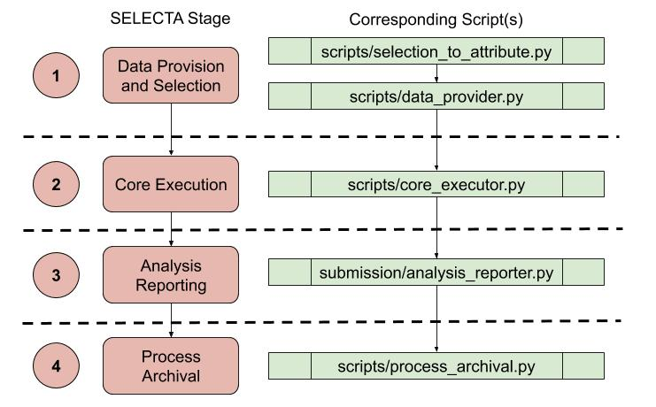

# ebi-selecta

#### Contents:
1. [What is SELECTA?](#what-is-selecta?)
2. [Installation](#installation)
    - [Ansible-Docker Install](#ansible-docker-install)
    - [Source Install](#source-install)
3. [Usage](#usage)
4. [Background](#background)
    - [Workflow](#workflow)
    - [Database](#database)

### What is SELECTA?
SELECTA is a rule-based workflow engine which runs analytical pipelines, and was initially developed to manage 
pipelines specific to the COMPARE community. SELECTA is a combined pipeline scheduler, runner and automatic analysis 
submitter. This provides an automated complete processing of datasets, consolidating different 
analysis pipelines into a sole computing and data access environment. 
Set criteria have been implemented in order to automatically acquire private datahub (group) reads for processing from 
the European Nucleotide Archive (ENA), with different complexity at the data grouping level. This translates to data 
being processed at the datahub level, which includes various ENA projects with runs associated to these projects. 
However the flexibility of SELECTA also enables for data processing to occur at the study level (including all runs 
within the study) and at the level of a single run. Upon acquiring the relevant data, SELECTA’s rule definition 
automatically instructs the processing and analysis of the reads, against a specific pipeline from those available.
Finally, automatic submission of analysis results back to the ENA mitigates the burden for a submitter when handling 
bulk submissions and ensures analysis results are consistently and accurately recorded.

---

### Installation
#### Ansible-Docker Install

Install [Ansible](https://docs.ansible.com/ansible/latest/installation_guide/intro_installation.html) and [Docker](https://docs.docker.com/install/).

#### Source Install

Clone this repository:
`git clone <repo>`

If utilising for COMPARE you will want to obtain the following codebases for the integrated COMPARE pipelines:
 - DTU_CGE
 - EMC_SLIM
 - UAntwerp_Bacpipe
 - RIVM_Jovian

Alternatively obtain the codebases of the analysis pipelines that you wish to implement in SELECTA.

Setup the SELECTA database and ensure credentials have been included in the `resources/properties.txt` file. See 
[Database](#database) for more information.

Setup a directory structure to include the following directories:
 * Process (for pipeline analysis processing)
 * Archive (for archiving the individual run pipeline processing)
 * Logs (to house the log files)
 * Cron (for cronjobs to run the individual stages)
 
Set up timely cronjobs for c-shell scripts (housed in Cron folder), one for each stage script (shown in fig.X).
[Run SELECTA Workflow](#run-selecta-workflow) provides more information.

Ensure the following dependencies have been met:
 - Python - v3.0+
    - joblib -  v0.13+
    - lxml.builder
    - lxml.etree - v4.3.4+
    - PyMySQL - v0.9+
    - psycopg2 - v2.8+
    - ruamel.yaml - v0.16.0+
    - xml.etree.ElementTree
 - Bash/Unix Shell
 - Singularity - v2.6.0+

Edit the `resources/properties.txt` appropriately. Note if implementing
development and production instances, ensure the properties file reflects this.

_For more detailed instructions of source installation, please see the PDF documentation._

---

### Usage

#### Populate with Selection
Introduce a selection into the process_selection table.

Example for a run:

`INSERT INTO process_selection(selection_id, datahub, study_accession, run_accession, pipeline_name, public, 
selection_provided_date, audit_time, webin, process_type, continuity) VALUES (24, 'dcc_name', 'PRJXXXXXX', 'ERRXXXXXX',
'DTU_CGE', 'NO', CURTIME(), CURTIME(), 'Webin-XXXXX', 'run', 'yes');
`

To create a selection for a study, provide a valid study_accession (run_accession is not required) and set process_type
to 'study'. Alternatively for a datahub, provide a valid datahub name (study_accession and run_accession are not 
required) and set process_type to 'datahub'.

#### Run SELECTA Workflow
###### Manual
If manually running each SELECTA stage, run each of the following scripts, one after the other:
selection_to_attribute.py, data_provider.py, core_executor.py, analysis_reporter.py and process_archival.py. In each 
case provide the properties file as an argument:

`[Arguments]
	-p (--properties_file)	File-path to properties file in resources directory of codebase.`
	
For example, for selection_to_attribute.py assuming the environment is appropriate for SELECTA to operate in (e.g. 
dependencies have been met, etc):

`python3 scripts/selection_to_attribute.py -p resources/properties.txt`

###### Automated
For steps described above, create individual cronjobs to run in a timely manner. Note that individual wrapper scripts 
(c-shell or bash) for each python script are required to ensure that environmental dependencies are set accordingly 
and script output is fed into log files. This will also enable for separation of development and production instances. 
Processing will be carried out for each selection introduced to the process_selection table. This setup also enables 
for multiple selections to be processed at once.

---

### Background

#### Workflow

The SELECTA workflow includes the stages shown in the image above. For each stage, an associated python script(s) is run.
The workflow can be recreated through cron jobs which run these scripts, note the order of the scripts. 

1. To process a run through SELECTA, introduce information about this run as a new selection in the process_selection
table. A selection contains information for SELECTA to understand what requires processing. This takes shape in the form
of a new row in the process_selection table. Data provision and selection initiates the workflow, obtaining this 
selection information and coupling it with metadata (defined upstream) about the run. The sequencing file(s) are 
downloaded to the directory named after the process_id (an identifier for the run and when it started the SELECTA 
workflow) inside the process directory.

2. Once data provision and selection has been completed successfully without error for the process_id, core execution can 
commence. This includes processing of the sequencing file(s) by the pipeline defined in the metadata obtained 
previously. SELECTA generates and runs the command for the integrated pipeline processing, taking place in the process 
directory. Analysis is consolidated into at least a single TSV file and a zipped processing folder.

3. Following, successful core execution, the resulting analysis produced from the pipeline processing for the process_id, 
is submitted to the ENA in analysis reporting. This involves generating XML objects for analysis and submission. At this
stage, analysis and submission IDs are provided, which are stored in the SELECTA database for the process ID.

4. Once analysis reporting for the process ID has been completed successfully without error, the pipeline processing 
directory is copied and therefore archived in the archive directory, during process archival.

The workflow has been described for a single run, however SELECTA processes multiple runs at once. A selection can 
include:
 - A single run (note this includes both sequencing files for paired-end runs/reads).
 - A study or project (this includes one or more individual runs).
 - A datahub (group), which includes one or more studies/projects.
 
#### Database
SELECTA utilises a database for storing, accessing and updating key information required for tracking the various 
processes. The database consists of 5 tables:
 - account
 - process_selection
 - process_stages
 - process_attributes
 - process_report
 
The image below presents the fields for each table:

